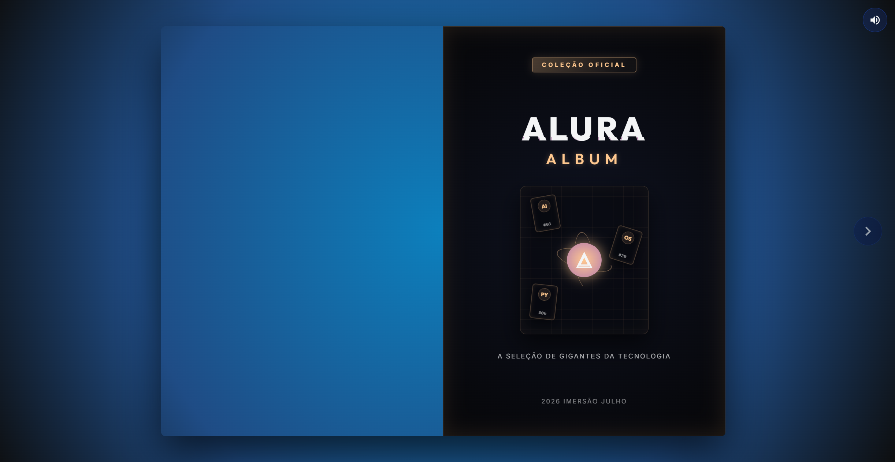

# Alura Album - Copa do Mundo Tech

Este projeto é um **álbum de figurinhas digital e interativo** temático de tecnologia, contendo grandes pioneiros da computação e inteligência artificial, além de instrutores e personalidades da Alura. Ele foi desenvolvido como parte da **Imersão de Arquitetura Web com IA da Alura**.

O projeto simula a experiência física de folhear um álbum de figurinhas de papel diretamente no navegador, completo com animações realistas de transição e efeitos sonoros dinâmicos.

---

## 🚀 Objetivo do Projeto

O objetivo principal é construir uma aplicação frontend interativa integrada com recursos modernos do navegador e, futuramente, consumindo uma API backend (FastAPI) para o carregamento dinâmico das figurinhas. A aplicação serve de base para o aprendizado de arquitetura web, manipulação do DOM, estilização avançada, síntese de áudio no navegador e integrações de APIs.

---

## 📂 Estrutura e Funcionalidade dos Arquivos

O projeto está estruturado da seguinte forma:

```text
├── code/
│   ├──
```

---

## 🛠️ Tecnologias

| Tecnologia            | Uso                                          |
| --------------------- | -------------------------------------------- |
| **HTML5**             | Estruturação semântica                       |
| **CSS3**              | Layout (Flexbox/Grid), animações, gradientes |
| **JavaScript (ES6+)** | Interatividade, requisições assíncronas      |
| **St.PageFlip**       | Simulação de virada de páginas               |
| **Web Audio API**     | Síntese de som de papel virando              |
| **FastAPI**           | Backend (configuração futura)                |

---

## 🚦 Interface


---

## 🚦 Como Executar o Projeto

---
